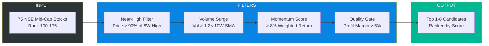
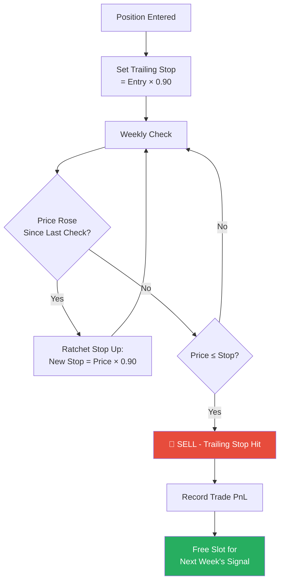

# Stock Selection Mechanism - Flowchart

## System Architecture

```mermaid
flowchart TD
    subgraph WEEKLY["🔄 WEEKLY SCAN (run_weekely.py)"]
        A[Start Weekly Scan] --> B[Get Universe:<br/>NSE Stocks Ranked 100-175<br/>by Market Cap]
        B --> C[Build Fundamentals Cache<br/>Fetch Profit Margins via yfinance]
        C --> D[Run Scanner on 75 Stocks]
    end

    subgraph SCANNER["🔍 SCANNER (scanner.py)"]
        D --> E[Download 1-Year Weekly OHLCV Data]
        E --> F{Has ≥ 30 weeks<br/>of data?}
        F -->|No| REJECT[❌ Reject]
        F -->|Yes| G[Compute Indicators:<br/>• 10-Week Volume SMA<br/>• 8-Week Rolling High]
        G --> H{Filter 1:<br/>Price > 90% of<br/>8-Week High?}
        H -->|No| REJECT
        H -->|Yes| I{Filter 2:<br/>Volume > 1.2×<br/>10-Week Avg Volume?}
        I -->|No| REJECT
        I -->|Yes| J[Compute Momentum Score:<br/>0.5 × Return_4w<br/>+ 0.3 × Return_8w<br/>+ 0.2 × Return_12w]
        J --> K{Filter 3:<br/>Score > 8%?}
        K -->|No| REJECT
        K -->|Yes| L{Filter 4:<br/>Profit Margin > 5%?}
        L -->|No| REJECT
        L -->|Yes| PASS[✅ Candidate]
    end

    subgraph RANKING["📊 RANKING & SIGNALS"]
        PASS --> M[Sort All Candidates<br/>by Momentum Score ↓]
        M --> N[Save to signals.csv]
    end

    subgraph PORTFOLIO["📁 PORTFOLIO MANAGEMENT"]
        N --> O[Check Existing Positions]
        O --> P{Current Price ≤<br/>Trailing Stop?}
        P -->|Yes| Q[Generate SELL Action]
        P -->|No| R[Update Trailing Stop:<br/>max old_stop,<br/>price × 0.90]
        Q --> S[Generate BUY Actions<br/>Fill Empty Slots<br/>from Top Signals]
        R --> S
        S --> T[Save actions.csv]
    end

    subgraph EXECUTION["💰 MONDAY EXECUTION (execute_monday.py)"]
        T --> U[Execute SELL Orders First]
        U --> V[Free Up Cash]
        V --> W[Execute BUY Orders]
        W --> X[Position Size = 12.5% of Equity]
        X --> Y[Set Initial Trailing Stop<br/>= Entry Price × 0.90]
        Y --> Z[Update Portfolio & Trades CSV]
        Z --> AA[Update Equity History]
    end

    style WEEKLY fill:#1a1a2e,color:#fff
    style SCANNER fill:#16213e,color:#fff
    style RANKING fill:#0f3460,color:#fff
    style PORTFOLIO fill:#533483,color:#fff
    style EXECUTION fill:#e94560,color:#fff
```

## Selection Filters Summary

## Risk Management Flow

## Configuration Parameters

| Parameter | Value | Description |
|-----------|-------|-------------|
| `UNIVERSE_START` | 100 | Start rank by market cap |
| `UNIVERSE_END` | 175 | End rank by market cap |
| `MAX_POSITIONS` | 8 | Maximum concurrent holdings |
| `POSITION_SIZE` | 12.5% | Equal-weight allocation per stock |
| `TRAILING_STOP` | 10% | Trailing stop loss percentage |
| `SCORE_THRESHOLD` | 8% | Minimum momentum score to qualify |
| `VOLUME_MULTIPLIER` | 1.2× | Volume must exceed this × average |
| `PROFIT_MARGIN_THRESHOLD` | 5% | Minimum profit margin (fundamental) |
| `TRANSACTION_COST` | 0.2% | Modeled cost per trade |
| `INITIAL_CAPITAL` | ₹1,00,000 | Starting capital |
